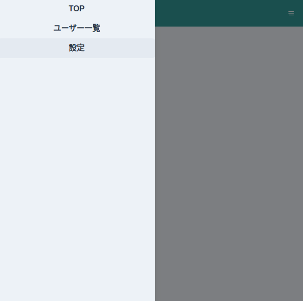
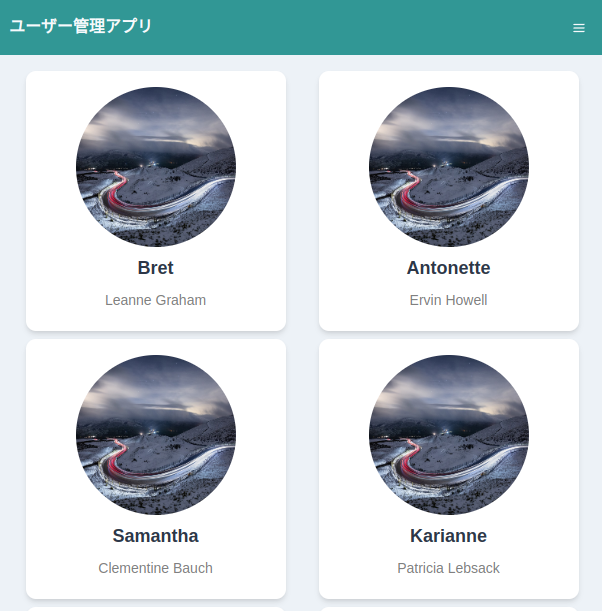
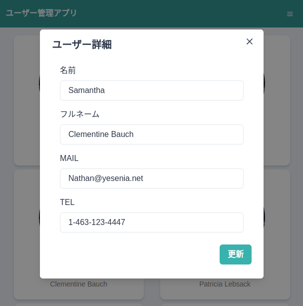

# JKE TS React

Udemy  
Reactに入門した人のためのもっとReactが楽しくなるステップアップコース完全版  
https://www.udemy.com/course/react_stepup/  


## About this course

「React何となく分かったけど次どうしたら良いか分からない」という人がステップアップするために知っておくべきことを順序立ててハンズオン形式で詰め込みました。  
本コースを終える頃にはもっとReactのことを好きになっていると思います。  


## Environment Setup


- create react project (JavaScript)  
	```sh
	$ npx create-react-app "project-name"
	$ npm init react-app "project-name"
	$ yarn create react-app "project-name"
	```
- create react project (TypeScript)  
	```sh
	$ npx create-react-app "project-name" --template typescript
	$ npm init react-app "project-name"  --template typescript
	$ yarn create react-app "project-name" --template typescript
	```


## Course Contents


### Section 1: はじめに

✅ 受講完了: 1回  


### Section 2: CodeSandboxについて

✅ 受講完了: 1回  


### Section 3: 再レンダリングの仕組みを知りレンダリングを最適化する

✅ 受講完了: 1回  


### Section 4: 様々なCSSのあてかたに触れる

✅ 受講完了: 1回  

#### inline style

- 疑似要素使えない  

#### node-sass

- 疑似要素使える  
- install node-sass ()  
	```sh
	$ yarn add node-sass
	```
#### styled-jsx

- 疑似要素使えない  
- install styled-jsx  
	```sh
	$ yarn add styled-jsx
	```

#### styled-components ○

- 疑似要素使える  
- install styled-components  
	```sh
	$ yarn add styled-components
	```

#### emotion ○

- 疑似要素使える  
- いろいろな書き方ができる  
- install emotion  
	```sh
	$ yarn add @emotion/styled
	$ yarn add @emotion/react
	```

### Section 5: ルーティングの基礎(ReactRouter)

✅ 受講完了: 1回  

- ReactRouterはVer5を使う  
- install react-router-dom  
	```sh
	$ yarn add react-router-dom@5.3.0
	```


### Section 6: コンポーネントの分割方法(AtomicDesign)

✅ 受講完了: 1回  

- install react-rooter-dom  
	```sh
	$ yarn add react-router-dom@5.3.0
	```
- install styled-components  
	```sh
	$ yarn add styled-components
	```


### Section 7: グローバルなstate管理を知る

✅ 受講完了: 1回  

- install recoil  
	```sh
	$ yarn add recoil
	```


### Section 8: JSONPlaceholderでのデータ取得解説

✅ 受講完了: 1回  

- https://jsonplaceholder.typicode.com/  
- install axios  
	```sh
	$ yarn add axios
	```


### Section 9: React×TypeScript(基礎編)

✅ 受講完了: 1回  


### Section 10: React×TypeScript(実践編)

✅ 受講完了: 1回  

- create react project (TypeScript)  
	```sh
	$ npx create-react-app "project-name" --template typescript
	$ npm init react-app "project-name"  --template typescript
	```
- ライブラリの型定義
	- ライブラリ自体に型定義が含まれているものと含まれていないものがある  
	- repositryのrootにindex.d.jsがあるかどうかで判断できる  
	- 含まれていなければ別途 `npm/yarn add @types/library-name` でインストールできる
	  


### Section 11: カスタムフック

✅ 受講完了: 1回  


### Section 12: 実践アプリ作成(ChakraUI)

https://github.com/reachscript-jak/react-intermediate-practice-app  

✅ 受講完了: 1回  

  

  

  

- CSSの有名なライブラリー  
	- MATERIAL-UI  
	- Tailwind CSS  
	- Semantic UI React  
	- Chakra UI  
- install chakra-ui (manual installation)  
	```sh
	$ npm i @chakra-ui/react @emotion/react@^11 @emotion/styled@^11 framer-motion@^6
	$ yarn add @chakra-ui/react @emotion/react@^11 @emotion/styled@^11 framer-motion@^6
	```
- install chakra-ui (autimatic installation)  
	```sh
	$ npx create-react-app my-app --template @chakra-ui/typescript
	$ yarn create react-app my-app --template @chakra-ui/typescript
	```
- install react-router-dom @types/react-router-dom 
	```sh
	$ yarn add react-router-dom@5.3.0
	$ yarn add @types/react-router-dom
	```
- install @chakra-ui/icons
	```sh
	$ yarn add @chakra-ui/icons
	```
- install axios  
	```sh
	$ yarn add axios
	```


### Section 13: さいごにとこれから

✅ 受講完了: 1回  

