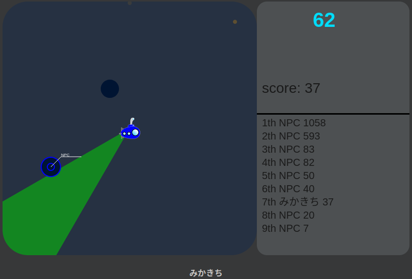

# NNN Node Online Game

  
  

Ｎ予備校 特別授業  
折原先生の 1日で作れる！ 〜Node.jsでオンラインゲーム〜  
https://www.nnn.ed.nico/contents/guides/2977/content  
https://www.nnn.ed.nico/lessons/482529080  
https://www.nnn.ed.nico/lessons/482529311  

https://github.com/progedu/submarine-online  


## Caution

- JavaScriptなので、タイポでバグるケースが多い(○radar ×rader のようなタイポ)ので注意すること。テキストのタイポも多いので、慎重にやること。  

- 初心者向けにするのに？ 関数に括りだせばまとめれるものも、まとめてなかったりするので、テキストのコードの記述量はとても多くなっている。内容をちゃんと理解した上で、コピペで進めていくのがよい。  

- Twitter認証用のキー(consumerKey, consumerSecret)を書いてあるファイル `config.js` をGitHubにPushすると危険なので、その変わりに伏せ字に置き換えた `config_templete.js` をPushしている。  


## Environment Setup


### Twitter Developer

https://developer.twitter.com/ にアクセスし、Developer登録をしておく。    
Twitter認証にはElevatedが必要、Essential(v2で追加された)ではできないので注意。  

### Docker

環境はDocker/Docker-Composeで構築した。  
Express関連にroot権限が必要そうだったのでrootで実行し(それで`User node`はコメントアウトしている)、コーディングのときだけディレクトリ全体の所有者を変更して進めていった。  
```sh
❯ sudo chown -R mika:mika submarine 
```

### Node.js

Version 8.9.4  
Version 18 (2022/6/16現在の最新版) ＆ 最新のライブラリ で進めていくとバグが多発したので、コースで使われているバージョンでやり直すとうまくいった。  

### Express skeleton

Expressのスケルトンを作成し、必要なパッケージも引っ張っておく。  
```sh
yarn global add express-generator@4.16.0
express --view=pug .
yarn install
```

### security package

セキュリティー関連のパッケージを追加する。  
```sh
yarn add helmet@1.1.0
```

### auth package

Twitter認証関連のパッケージを追加する。  
```sh
yarn add passport@0.4.0 passport-twitter@1.0.4 express-session@1.15.6
```

### module bundler package

モジュールバンドラーのパッケージを追加する。  
```sh
yarn add webpack@3.10.0 babel-loader@7 babel-core babel-preset-env
```

### Framework

フレームワークを追加する。  
```sh
yarn add jquery@3.3.1
```

### WebSocket

WebSocketのパッケージを追加する。  
```sh
yarn add socket.io@2.2.0 socket.io-client@2.2.0
```

### execute

モジュールバンドラーでコンパイルするには…  
```sh
npx webpack
node_modules/.bin/webpack
```
サーバーを走らせるには…  
```sh
PORT=3000 yarn start
```


## Course Contents


### part 1: オンライン潜水艦ゲーム

✅ 受講完了: 1回  


### part 2: Express フレームワークの環境構築

✅ 受講完了: 1回  

Expressのスケルトンを作成し、必要なパッケージも引っ張っておく。  
```sh
yarn global add express-generator@4.16.0
express --view=pug .
yarn install
```
セキュリティー関連のパッケージを追加する。  
```sh
yarn add helmet@1.1.0
```
サーバーを走らせるには…  
```sh
PORT=3000 yarn start
```


### part 3: Twitter 認証機能を実装しよう

✅ 受講完了: 1回  

Twitter API v2 には３つのAccessLevelがあり、Twitter認証にはElevatedが必要なので注意。（part4 で思いっきり嵌った）  


### part 4: Twitter ログインの実装

✅ 受講完了: 1回  

Twitter認証関連のパッケージを追加する。  
```sh
yarn add passport@0.4.0 passport-twitter@1.0.4 express-session@1.15.6
```
secretは次のコマンドを使って作成するとよい  
```js
require('crypto').randomBytes(8).toString('hex')
```
Twitter API v2 には３つのAccessLevelがあり、Twitter認証にはElevatedが必要だった。  
Essential(v2で追加された)ではできない。エラーメッセージはそういう意味だった。  
~~仕様が変わったのか、エラーが出てTwitterログインできなかった。~~  
~~調べてもわからないので、未来の自分に託すことにした。~~  
  


### part 5: game ページの作成

✅ 受講完了: 1回  


### part 6: Webpack のインストールと設定

✅ 受講完了: 1回  

モジュールバンドラーのパッケージを追加する。  
```sh
yarn add webpack@3.10.0 babel-loader@7 babel-core babel-preset-env
```
モジュールバンドラーでコンパイルするには…  
```sh
npx webpack
node_modules/.bin/webpack
```


### part 7: ゲーム画面の作成

✅ 受講完了: 1回  

フレームワークを追加する。  
```sh
yarn add jquery@3.3.1
```


### part 8: WebSocket を使った通信の実装

✅ 受講完了: 1回  

WebSocketのパッケージを追加する。  
```sh
yarn add socket.io@2.2.0 socket.io-client@2.2.0
```


### part 9: プレイヤーとアイテムを配置しよう

✅ 受講完了: 1回  


### part 10: プレイヤーを移動させる実装

✅ 受講完了: 1回  


### part 11: 潜水艦を操作できるようにしよう

✅ 受講完了: 1回  


### part 12: アイテムを取れるように実装しょう

✅ 受講完了: 1回  


### part 13: 他のプレイヤーの表示

✅ 受講完了: 1回  


### part 14: GameOver 時の実装

✅ 受講完了: 1回  


### part 15: ミサイルを打てるようにしよう

✅ 受講完了: 1回  


### part 16: NPC を実装しよう

✅ 受講完了: 1回  


### part 17: スコアランキングの表示

✅ 受講完了: 1回  

